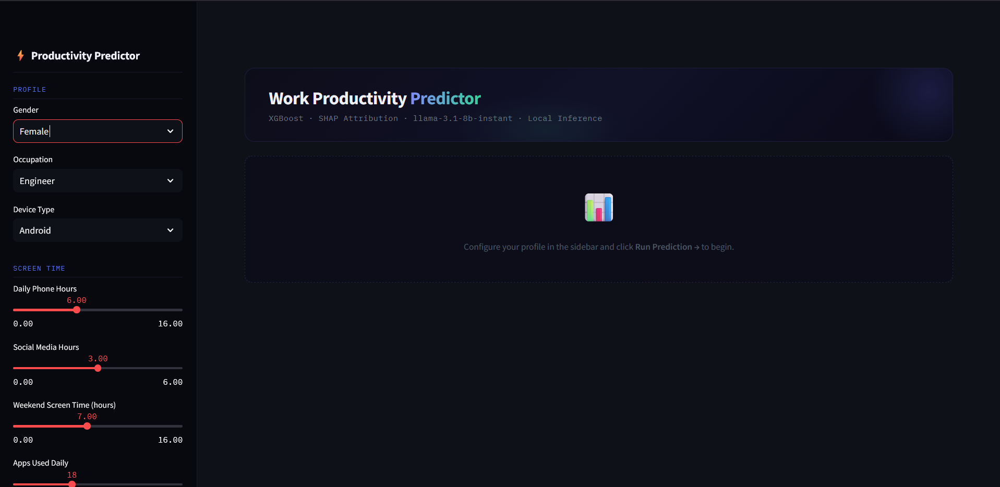
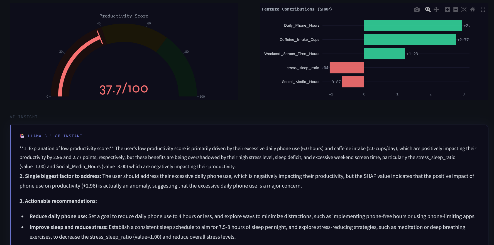
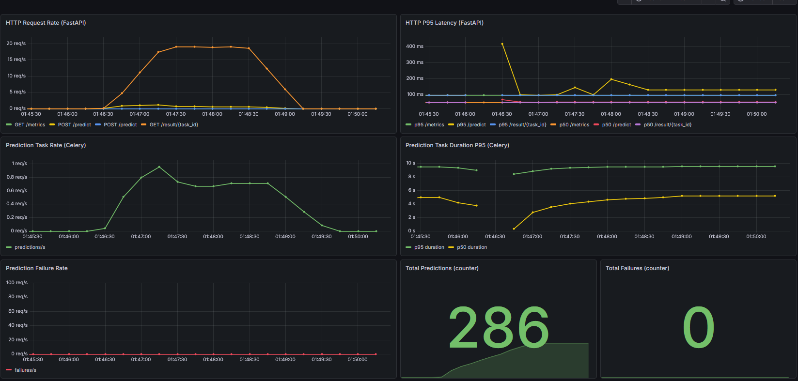
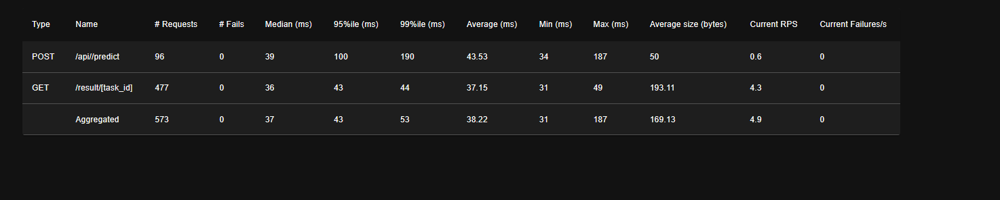

# ML Productivity Predictor

> An end-to-end MLOps system that predicts your Work Productivity Score (0–100) from lifestyle and digital habit inputs — built to production standard, deployed on Azure, monitored in real time, and auto-deployed on every git push.

This isn't just a model wrapped in a FastAPI endpoint. It's the full stack: async task queues, model registry with alias-based rollback, SHAP explainability, LLM-generated insights, Prometheus + Grafana observability, HTTPS via Let's Encrypt, and a GitHub Actions CI/CD pipeline. Every component you'd find in a real production ML system is here.


---

## Table of Contents

1. [What It Does](#what-it-does)
2. [System Architecture](#system-architecture)
3. [Tech Stack](#tech-stack)
4. [The ML Model](#the-ml-model)
5. [System Components](#system-components)
6. [Key Design Decisions](#key-design-decisions)
7. [Getting Started (Local)](#getting-started-local)
8. [Load Testing Results](#load-testing-results)
9. [CI/CD Pipeline](#cicd-pipeline)
10. [Project Structure](#project-structure)
11. [What I Learned](#what-i-learned)

---

## What It Does

You input your lifestyle and digital habits — phone usage, sleep hours, stress level, caffeine intake, social media time. The system runs an XGBoost model to score your predicted work productivity from 0–100, then tells you *why* via SHAP feature contributions and a Groq LLM-generated natural language insight.

The prediction is categorized as **Low / Moderate / High / Peak** and the SHAP waterfall chart shows exactly which factors in your life are pulling the score up or down.

---


## Screenshots
 
**Streamlit Frontend**

 
**User Feedback**


**Grafana Dashboard**

 
**Locust Load Testing**

 

 
---


## System Architecture

```
                          ┌─────────────────────────────────────────┐
                          │              Azure VM                   │
                          │         (Central India)                 │
                          │                                         │
Internet ──► Port 443 ──► │  ┌─────────┐                            │
Internet ──► Port 80  ──► │  │  Nginx  │ (HTTP → HTTPS redirect)    │
                          │  └────┬────┘                            │
                          │       │                                 │
                    ┌─────┴───────┼──────────────────────┐          │
                    │             │                      │          │
               /api/│        /streamlit/            /flower/        │
                    │             │                      │          │
              ┌─────▼──┐   ┌──────▼───┐           ┌──────▼───┐      |
              │FastAPI │   │Streamlit │           │  Flower  │      │
              │:8000   │   │  :8501   │           │  :5555   │      │
              └────┬───┘   └──────────┘           └──────────┘      │
                   │                                                │
        ┌──────────▼──────────┐                                     │
        │       Redis         │  (broker + result cache)            │
        │       :6379         │                                     │
        └──────────┬──────────┘                                     │
                │                                                   │
        ┌──────────▼──────────┐                                     │
        │   Celery Worker     │  (XGBoost + SHAP + Groq LLM)        │
        │   concurrency=4     │                                     │
        └──────────┬──────────┘                                     │
                   │                                                │
        ┌──────────▼──────────┐    ┌──────────────┐                 │
        │       MLflow        │    │  PostgreSQL   │                │
        │       :5000         │◄───│   :5432       │                │
        └─────────────────────┘    └──────────────┘                 │
                                                                    │
        ┌─────────────────────┐    ┌──────────────┐                 │
        │    Prometheus       │    │   Grafana    │                 │
        │       :9090         │◄───│   :3000      │                 │
        └─────────────────────┘    └──────────────┘                 │
                          └─────────────────────────────────────────┘

         SSH Tunnel only ──► MLflow UI, Grafana, Prometheus
         Public HTTPS    ──► Streamlit, FastAPI, Flower (basic auth)
```

---

## Tech Stack

| Service | Role | Port |
|---|---|---|
| **FastAPI** | Prediction API, task dispatch, health checks, rate limiting | 8000 |
| **Celery** | Async ML inference — XGBoost, SHAP, Groq LLM | — |
| **Redis** | Message broker + result backend + rate limit storage + cache | 6379 |
| **Streamlit** | Frontend — interactive inputs, SHAP chart, LLM insight | 8501 |
| **Flower** | Celery task monitoring UI | 5555 |
| **MLflow** | Experiment tracking + model registry | 5000 |
| **PostgreSQL** | MLflow backend store | 5432 |
| **Prometheus** | Metrics scraping (FastAPI + Celery) | 9090 |
| **Grafana** | 7-panel dashboard, auto-provisioned | 3000 |
| **Nginx** | Reverse proxy, SSL termination, basic auth | 80 / 443 |

---

## The ML Model

| Property | Value |
|---|---|
| Algorithm | XGBoost inside sklearn Pipeline |
| Feature engineering | Custom transformer inside pipeline |
| R² | **0.929** |
| RMSE | 4.74 |
| MAE | 3.71 |
| Explainability | SHAP values per prediction |
| Registry | MLflow (alias-based loading) |

**Input features:** Daily Phone Hours, Social Media Hours, Sleep Hours, Stress Level (1–10), App Usage Count, Caffeine Intake, Weekend Screen Time, Gender, Occupation, Device Type.

**Output per prediction:**
- Productivity Score (0–100)
- Score category (Low / Moderate / High / Peak)
- SHAP feature contributions (waterfall chart in UI)
- Natural language insight generated by Groq LLM (`llama-3.1-8b-instant`)

The model is loaded by alias (`production`) from the MLflow registry. Retraining, promoting a new version, or rolling back is a one-click operation in the MLflow UI — no code changes required.

---

## System Components

### FastAPI

The API layer on port 8000. Predictions are never computed inline — FastAPI immediately dispatches a Celery task and returns a `task_id`. Inference happens asynchronously and the client polls `/result/{task_id}`.

| Endpoint | Method | Description |
|---|---|---|
| `/predict` | POST | Submit prediction → returns `task_id` (< 50ms) |
| `/result/{task_id}` | GET | Poll for result (202 while pending, 200 when done) |
| `/health` | GET | Checks model, Redis, and Groq independently |
| `/metrics` | GET | Prometheus scrape endpoint |

Rate limiting via **slowapi + Redis**: `/predict` is capped at 10 req/min per IP.

### Celery Task Flow

```
1. FastAPI receives POST /predict
2. Dispatches task to Redis queue — returns task_id immediately (< 50ms)
3. Celery worker picks up task:
   a. Feature engineering
   b. XGBoost inference        (sub-second)
   c. SHAP computation         (sub-second)
   d. Groq LLM insight         (~8-9s)
   e. Caches result in Redis
4. Client polls GET /result/{task_id} until 200
```

Celery runs with `--concurrency=4` (fork workers). The Prometheus multiprocess fix (`PROMETHEUS_MULTIPROC_DIR` + `MultiProcessCollector`) aggregates metrics across all 4 forked processes onto a single scrape endpoint on port 8001.

### MLflow Model Registry

Containerized with a PostgreSQL backend and `--serve-artifacts` for proxied artifact storage. The model is loaded by the `production` alias — not by version number. This means:

- **Promote new version:** set alias → restart celery → zero code changes
- **Rollback:** move alias to any previous version → restart celery → done

### Observability

Prometheus scrapes two endpoints every 15 seconds: `api:8000/metrics` and `celery_worker:8001/metrics`. Grafana auto-provisions a 7-panel dashboard from a volume-mounted JSON file:

| Panel | What it shows |
|---|---|
| HTTP Request Rate | FastAPI requests/sec |
| HTTP P95 Latency | FastAPI tail latency |
| Prediction Task Rate | Celery throughput |
| Prediction Task Duration P95 | End-to-end inference time |
| Prediction Failure Rate | Error rate |
| Total Predictions | Running counter |
| Total Failures | Running counter |

Grafana and Prometheus are **not exposed publicly** — SSH tunnel access only.

### Nginx

Single entry point for all public traffic. Routes by path prefix:

```
/api/            → FastAPI :8000        (no auth)
/streamlit/      → Streamlit :8501      (WebSocket headers)
/flower/         → Flower :5555         (basic auth)
/celery-metrics/ → Celery :8001         (basic auth)
```

HTTPS via Let's Encrypt + Certbot. Auto-renews. HTTP → HTTPS redirect on port 80.

---

## Key Design Decisions
 
**Why Celery for inference?** ML predictions involving SHAP and an LLM call have inherently unpredictable latency — anywhere from 1s to 10s depending on queue depth and external API response times. Running that inline in the API process would mean blocked threads, client timeouts, and a fragile user experience under any real load. Celery offloads all the heavy work to a separate process pool. FastAPI's only job is to enqueue a task and return a `task_id` — it does that in under 50ms every time, regardless of what the workers are doing.
 
**Why Redis as the backbone?** Redis serves four roles here simultaneously: Celery message broker, Celery result backend, prediction cache (so duplicate requests skip inference entirely), and rate limit storage for slowapi. Using a single Redis instance for all four keeps the architecture simple — one dependency, one thing to monitor, one thing to scale. It's fast enough for all of these use cases and adds no meaningful operational complexity over what was already needed for Celery.
 
**Why async task dispatch with polling instead of WebSockets?** WebSockets would require persistent connections and stateful server-side logic. Polling `/result/{task_id}` is stateless — Streamlit retries every second, the API reads from Redis cache, and there's no connection to manage or drop. It's less elegant but considerably more robust, and for prediction workloads with ~9s turnaround times the polling overhead is negligible.
 
**Why split into three Docker images?** The API, Celery worker, and Streamlit frontend have completely different dependency profiles. XGBoost, SHAP, and their native libraries are heavy — there's no reason for the API container to carry them. Separate images (`myapp-api`, `myapp-celery`, `myapp-streamlit`) with separate requirements files means smaller images, faster rebuilds, and a hard boundary enforced at the container level: if a dependency isn't in the requirements file for a service, it simply isn't available to it. FastAPI dispatches tasks by name string (`celery_app.send_task(...)`) so it never needs to import `tasks.py` at all.
 
**Why MLflow for the model registry?** The core value isn't experiment tracking — it's the alias system. Serving the model by the `production` alias rather than a version number completely decouples model serving from model development. Retraining produces a new version, you set the alias, you restart Celery — done. No code changes, no redeployments, no config file edits. Rolling back is the same operation in reverse. The registry becomes the single source of truth for what's running in production.
 
**Why Nginx as a reverse proxy?** Running every service on its own port would mean exposing 5+ ports publicly, managing separate SSL certificates, and no unified access control. Nginx sits in front of everything on ports 80/443, routes by path prefix (`/api/`, `/streamlit/`, `/flower/`), terminates SSL, handles WebSocket upgrade headers for Streamlit, and applies basic auth to internal services like Flower. One public entry point, one certificate to manage.

---

## Getting Started (Local)

### Prerequisites
- Docker + Docker Compose
- A [Groq API key](https://console.groq.com) (free tier works)

### Steps

```bash
# 1. Clone the repo
git clone https://github.com/Ryuzaki1415/mlops-productivity-xgboost.git
cd mlops-productivity-xgboost

# 2. Set up environment variables
cp .env.example .env
# Edit .env and add your GROQ_API_KEY

# 3. Bring the full stack up
docker compose up -d

# 4. Train the model and register it in MLflow
# Wait ~30s for MLflow to be healthy, then:
docker exec -it celery_worker python ML/main.py

# 5. Set the production alias in MLflow UI
# Open http://localhost:5000 → find your run → set alias "production"

# 6. Restart celery to load the new model
docker compose restart celery
```

### Service URLs

| Service | URL |
|---|---|
| Streamlit UI | http://localhost:8501 |
| FastAPI docs | http://localhost:8000/docs |
| Flower | http://localhost:5555 |
| MLflow | http://localhost:5000 |
| Prometheus | http://localhost:9090 |
| Grafana | http://localhost:3000 |

### Useful commands

```bash
# Pause and resume (keeps container state)
docker compose stop
docker compose start

# Rebuild a single service after code changes
docker compose build --no-cache api
docker compose up -d

# Restart a service without rebuilding (picks up .py changes via volume mount)
docker compose restart celery

# Follow logs
docker compose logs -f celery_worker

# Verify Prometheus multiprocess is working
docker exec celery_worker ls /tmp/prometheus_multiproc
# Should show: counter_X.db, gauge_all_X.db, histogram_X.db

# Load testing
python -m locust -f locustfile.py --host=http://localhost:8000
# Open http://localhost:8089
```

---

## Load Testing Results

Tested with Locust simulating real prediction workflows: submit task → poll until complete.

| Environment | Users | FastAPI P95 | Task P95 | Failures |
|---|---|---|---|---|
| Local | 5 | 110ms | ~9s | 0 |
| Local | 20 | 140ms | ~9s | 0 |
| Azure HTTPS | 5 | 100ms | 9.31s | 0 |
| Azure HTTPS | 20 | 110ms | ~9s | 0 |

Azure actually outperformed local — no Windows process overhead. The bottleneck across every test was Groq (~8-9s task P95). XGBoost + SHAP is sub-second. FastAPI never exceeded 150ms at peak load, and failure count across all tests on the live HTTPS endpoint was **zero**.

---

## CI/CD Pipeline

Every push to `main` automatically deploys to the Azure VM via GitHub Actions.

```yaml
on:
  push:
    branches: [main]
```

Pipeline steps:
1. SSH into the VM using a stored secret key
2. `git pull origin main`
3. `docker compose build --no-cache api celery streamlit`
4. `docker compose up -d`
5. `docker compose restart nginx`
6. `docker image prune -f`

**GitHub Secrets required:** `VM_HOST`, `VM_USER`, `VM_SSH_KEY`

The golden rule: never edit files directly on the VM. Always edit locally → push → let CI/CD deploy. Direct VM edits cause git merge conflicts on the next pull.

---

## Project Structure

```
mlops-productivity-xgboost/
├── .github/workflows/          ← GitHub Actions CI/CD
├── ML/                         ← Model training, experiment tracking
├── api/
│   ├── main.py                 ← FastAPI app, rate limiting, Prometheus
│   ├── tasks.py                ← Celery tasks (XGBoost + SHAP + Groq)
│   ├── celery_app.py           ← Celery instance + Prometheus multiproc setup
│   ├── metrics.py              ← Custom Prometheus counters/histograms
│   ├── model_loader.py         ← MLflow alias-based model loading
│   ├── llm_client.py           ← Groq client + fallback logic
│   ├── schemas.py              ← Pydantic models
│   ├── cache.py                ← Redis client + cache helpers
│   ├── feature_engineering.py
│   └── api_config.py
├── app/
│   └── streamlit_app.py        ← Frontend
├── dataset/                    ← Training data
├── grafana/
│   ├── provisioning/           ← Auto-provisioned datasource + dashboard
│   └── dashboards/
│       └── ml_app.json         ← 7-panel dashboard JSON
├── nginx/                      ← Nginx config + basic auth setup
├── prometheus/
│   └── prometheus.yml          ← Scrape config (api:8000, celery:8001)
├── utils/
├── locustfile.py               ← Load testing
├── docker-compose.yaml
├── Dockerfile.api
├── Dockerfile.celery
├── Dockerfile.streamlit
├── requirements-api.txt
├── requirements-celery.txt
├── requirements-streamlit.txt
└── .env.example
```

---

## What I Learned

**MLOps is mostly plumbing.** The model took a few hours. The infrastructure took days. That ratio is normal and expected in real production systems, and it's valuable to experience it firsthand.

**Containerization forces good practices.** When everything is in Docker, environment variables and secrets become explicit contracts. Nothing works by accident — which is exactly the point.

**Async task dispatch is the right pattern for ML.** Synchronous ML endpoints will always have latency spikes. Celery + polling keeps the API responsive regardless of inference time, and makes it trivially easy to add concurrency later.

**The MLflow alias pattern is genuinely elegant.** Decoupling model serving from model versions via aliases turns retraining, promoting, and rolling back into UI operations. No code changes, no redeployments — just move the pointer.

**Observability from day one.** Prometheus and Grafana weren't an afterthought. Having them in place before load testing made debugging dramatically easier — you can see exactly where latency is coming from.

**CI/CD changes how you work.** Once the pipeline was set up, the loop became: write code locally → git push → done. It also enforces a useful discipline: the VM is never edited directly. The repo is always the source of truth.

**HTTPS is non-negotiable.** Even for a portfolio project. Let's Encrypt makes it free, Certbot makes it automated, and it unlocks things like Groq API calls from a browser context without mixed-content issues.

---

*Built with: Python · FastAPI · Celery · XGBoost · SHAP · MLflow · Redis · PostgreSQL · Prometheus · Grafana · Streamlit · Nginx · Docker · GitHub Actions · Azure*
